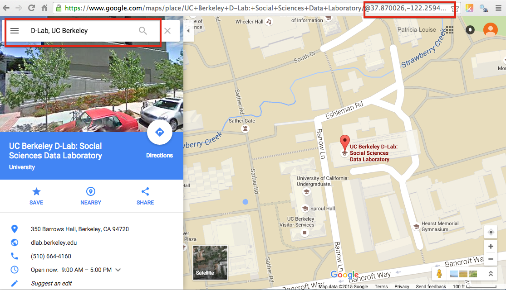
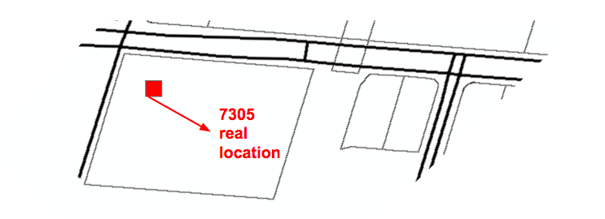
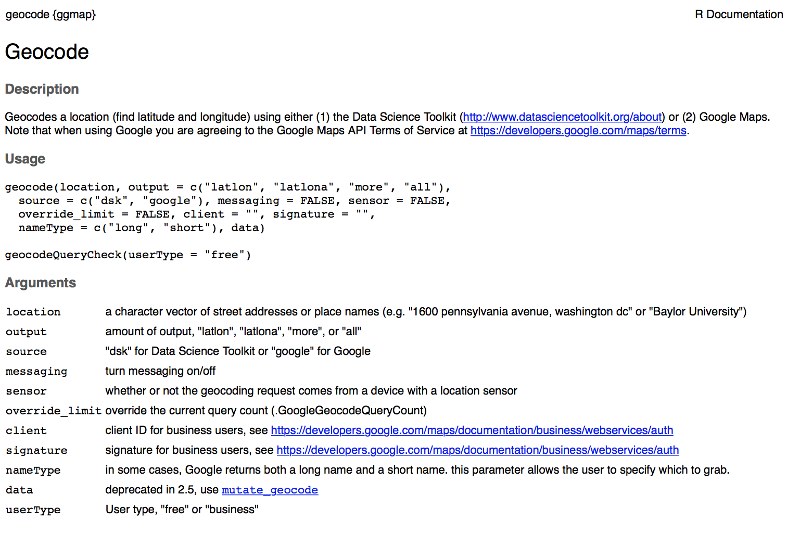
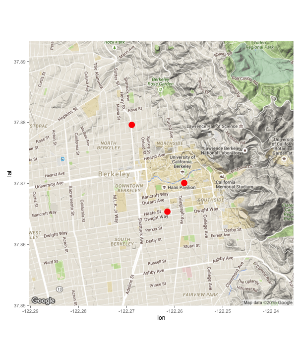
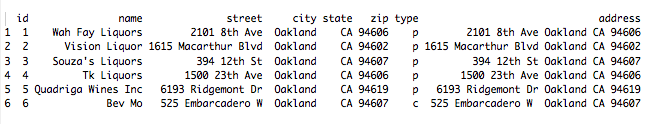
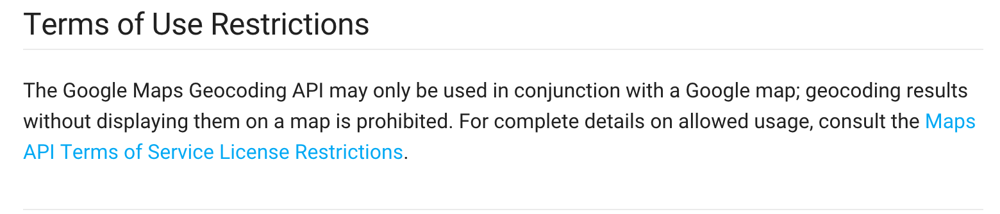
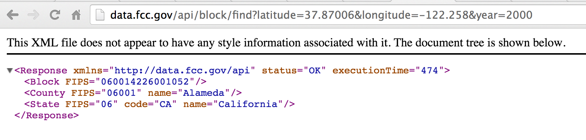
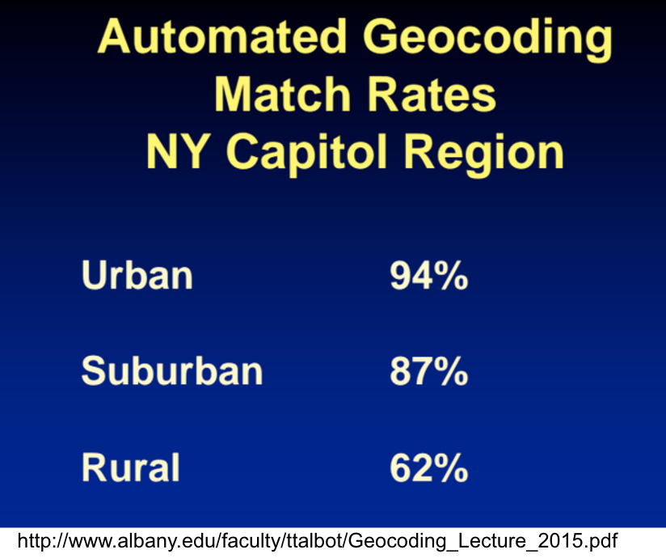

## Geocoding in R

Getting Started: Download the zipfile for this tutorial from
https://github.com/dlab-geo/RGeocoding/archive/master.zip

Then,

- unzip the files
- start RStudio
- start a new script file and set your working directory to
the location of the unzipped files
- open the file scripts/ggmap_geocoding_examples.R 
    - update the working directory

## Overview

- What is Geocoding
- Why Geocode
- Google Maps examples
- A brief overview of Geographic Coordinates
- Geocoding in Detail
- How to Geocode in R
    - with GGMAPS
    - with Census Geocoding Service
- Next Steps

## What is Geocoding

Determine the geographic coordinates of a named place, street address, or zip code.

- city, building, 
- street address, intersection, 
- mountain, landmark,
- crime or other event location,
- zip code, etc.

## Why Geocode?

- Display locations on a map
- Link locations to other data
- Spatial analysis
    - Calculate distance, direction, area, etc.
    - Identify patterns & relationships:
        - clusters, outliers, neighbors

## Try It!

maps.google.com

*Try entering a city, landmark (Sather Gate), zipcode, address, etc.*

## Geographic Coordinates

||
------------------------|-----------------------------------|-
**Latitude**|+/- 90 degrees|*how far north or south of equator*
**Longitude**|+/- 180 degrees|*how far E/W of prime meridian*

**Decimal Degrees (DD)**  
37.870145, -122.25952

**Degrees, minutes, seconds (DMS)**  
37° 52' 12"N, 122° 15' 36" W

## Geographic Coordinate Reference Systems

Longitude & latitude specify locations on the surface of the earth with respect to a Coordinate Reference System (CRS).

Components of a CRS:

- datum: specifies the shape of the earth (the Ellipsoid) and fits the ellipsoid to the Earth
- units: e.g., meters, feet, decimal degrees
- latitude of origin: Equator
- longitude of origin: Prime Meridian

## Reference Ellipsoids

There are many CRSs because there have been many specifications of the shape of the Earth.

## Commonly used Geographic CRS
- **WGS84**: global CRS used by GPS and satellite data. The default.
- **NAD83**: North American Datum 1983. US Federal geographic data projects

For US locations, these global CRSs area identical for most purposes.

## Projected CRS - Map Projects
Transform coordinates from 3D sphere to a 2D plane.

## Why do you need to care about CRSs?
- In R, you will get an error message if you try to analyze spatial data objects with different CRSs
    - This is a good thing!
- Different CRSs may specify different locations for the same place

## Address Geocoding

 

## Where do Addresses come from?

- Extract from text documents
- File or Database
- Web Scraping

## Address Geocoding Details

## Evaluation

Reference database extremely important

## Geocoder Output Comparison

 

## Considerations

- Geographic scope
- Time period
- Output Quality
- Number of addresses
- Data Privacy/security
- Cost: free..freemium..premium
- Ease of use

## Local Geocoding

ESRI ArcGIS with local reference database

- Benefits
    - highly customizable
    - fast & robust software
    - easy to use GUI
    - secure

- Issues
    - need local reference database
        - campus has access to high quality 2014 data
    - limited to USA & Canada
    
## Remote Geocoding Services

- ArcGIS Online
- Google
- Yahoo, Bing, Here
- OpenStreetMaps
- Data Science Toolkit (DSTK)
- *and many others*

## Geocoding in R

Access an online Geocoder using an API
*Application Progromming Toolkit*

- Via a package or script

## Geocoding in R with

- GGMAPS
    - Google
    - DSTK

- US Census TIGER Geocoding Service

## Geocoding with GGMAP
- Created by David Kahle and Hadley Wickham, ggplot2 developer

- Includes functions for Geocoding using:
    - the Data Science Toolkit (DSTK) geocoding service 
     - Google's Geocoding service

- Also has functionality for creating maps
    - and other cool stuff, like measuring distances

        
## Geocoding with GGMAP

- The Data Science Toolkit (DSTK) geocoding service 
    - default, unlimited usage
    - FOSS: free and open source softare (& data)
    - good, not great output quality
    - older data, limited geographic coverage
    - *service sometimes unavailable*
        
## Geocoding with GGMAP

- Google's Geocoding service
    - fantastic accuracy, easy, fast, 
    - worldwide coverage, up to date
    - limited to 2500 addresses per day
    - other usage limits may also apply!
        - http://developers.google.com/maps/terms

## Geocoding with GGMAP with Google Geocoder

Follow along with slides in RStudio or load:

- **scripts/ggmap_geocoding_examples.R**

## Geocoding with GGMAP with Google Geocoder

<pre>
> #install.packages("ggmap") # if not already installed
> library(ggmap)
> geocode("Barrows Hall, Berkeley, CA", source="google")

       lon      lat
1 -122.258 37.87006
</pre>

## Try it!

Try using GGMAP to Geocode:

    - an address
    - a zipcode
    - a state
    - landmark or building

*Be sure to specify source="google"*

Copy & paste the output coordinates in **maps.google.com** search bar.

  - Coordinates must be in *lat,lon* order, comma separated!

## Getting Help: ?geocode

## Geocoding Output

You get: **Point coordinates**

If you want **polygons** you need to:

- load the polygon data into R
    - from a package (eg maps)
    - from a file (e.g., census TIGER data)

 
- match by place name

## Geocoding Historic Locations

Good question!

## Explore Geocode Options for *output=*

- geocode("Barrows Hall, Berkeley, CA", source="google", output="latlon")
- geocode("Barrows Hall, Berkeley, CA", source="google", output="latlona")
- geocode("Barrows Hall, Berkeley, CA", source="google", output="more")
- geocode("Barrows Hall, Berkeley, CA", source="google", output="all")

## Output differences
<pre>
> geocode("Barrows Hall, Berkeley, CA", source="google", output="latlon")
       lon      lat
1 -122.258 37.87006

> geocode("Barrows Hall, Berkeley, CA", source="google", output="latlona")
       lon      lat                               address
1 -122.258 37.87006 barrows hall, berkeley, ca 94720, usa
</pre>

## Output differences
<pre>
> geocode("Barrows Hall, Berkeley, CA", source="google", output="more")

       lon      lat    type loctype                               address    north    south
1 -122.258 37.87006 premise rooftop barrows hall, berkeley, ca 94720, usa 37.87147 37.86877
       east      west      premise locality administrative_area_level_2
1 -122.2566 -122.2593 Barrows Hall Berkeley              Alameda County
  administrative_area_level_1       country postal_code
1                  California United States       94720

> geocode("Barrows Hall, Berkeley, CA", source="google", output="all")
# not shown!
</pre>

## Checking Output Quality
<pre>
> one <- geocode(location="7305 Edgewater Dr Oakland CA 94621", 
            source="google", output="more")
> two <- geocode("sather gate, berkeley, ca", 
            source="google", output="more", messaging=TRUE)

> one$loctype
[1] rooftop

> two$loctype
[1] approximate

</pre>

## Append geocoded info to input data

Create a data frame with three addresses

<pre>

> df <- data.frame(
          address = c(
              "1517 Shattuck Ave, Berkeley, CA 94709", 
              "Barrows Hall, Berkeley, CA", 
              "2332 Haste St, Berkeley, CA 94704"
          ),
          stringsAsFactors = FALSE
        )

> df
                                address
1 1517 Shattuck Ave, Berkeley, CA 94709
2            Barrows Hall, Berkeley, CA
3     2332 Haste St, Berkeley, CA 94704
</pre>

## Geocode the three Addresses

<pre>
> df2 <- geocode(df$address,source="google", output="more")

# just keep lat, lon, type, and loctype
> df2 <- df2[,c(1:4)]

> df2
        lon      lat           type loctype
1 -122.2689 37.87959 street_address rooftop
2 -122.2580 37.87006        premise rooftop
3 -122.2615 37.86537 street_address rooftop
</pre>

## Join output to input
<pre>
> df3 <- data.frame(df,df2)

> df3
                                address       lon      lat           type loctype
1 1517 Shattuck Ave, Berkeley, CA 94709 -122.2689 37.87959 street_address rooftop
2            Barrows Hall, Berkeley, CA -122.2580 37.87006        premise rooftop
3     2332 Haste St, Berkeley, CA 94704 -122.2615 37.86537 street_address rooftop
> 

</pre>

## Map it with GGMAP

<pre>
map <- get_map(location=c(lon=mean(df3$lon), lat=mean(df3$lat)), zoom=14)
ggmap(map) +
  geom_point(aes(x = lon, y = lat), data=df3, size = 6, col="red" )  
</pre>

*Try different (or no) zoom levels!*

## Geocode a file of addresses

<pre>
# get the input data
data <- read.csv(file="address_data/formatted/
    oak_liq_w_ids_types_headers.csv",stringsAsFactors=F)
head(data)

  id               name              street     city state   zip type
1  1    Wah Fay Liquors        2101 8th Ave  Oakland    CA 94606    p
2  2      Vision Liquor 1615 Macarthur Blvd  Oakland    CA 94602    p
3  3    Souza's Liquors         394 12th St  Oakland    CA 94607    p
4  4         Tk Liquors       1500 23th Ave  Oakland    CA 94606    p
5  5 Quadriga Wines Inc   6193 Ridgemont Dr  Oakland    CA 94619    p
6  6             Bev Mo   525 Embarcadero W  Oakland    CA 94607    c

</pre>
*Google requires address in one column (not multiple)*

## Create Address Column - full address in one column
<pre>
data$address <- with(data,paste(street,city,state,zip, sep=","))
head(data) # look at the data frame
 
</pre>

## Odd address formats can be a problem

<pre>

> data[19,8]
"7305 Edgewater Dr #D,Oakland,CA,94621"

> geocode(data[19,8], source="google", output="latlona")
        lon      lat                                    address
1 -81.44055 28.62331 7305 edgewater dr, lockhart, fl 32810, usa
</pre>

## Update address
<pre>

data[19,8]<-"7305 Edgewater Dr,Oakland,CA,94621"  
</pre>

*Now geocode that address again.*

## Geocode a File of addresses
<pre>
geocoded_output <- geocode(data$address, output = "latlona", 
        source = "google")
        
geocoded_output <- data.frame(data, geocoded_output)

head(geocoded_output) # check it

# Save output to file
write.csv(geocoded_output,file="geocoded_output.csv", row.names=FALSE)
</pre>

## Know Your limits

####Scaling up to more than 2500 records?
<pre>
> geocodeQueryCheck() #how am I doing?
2489 geocoding queries remaining.
</pre>

Blog with code for geocoding more than 2,500 addresses:

- http://www.shanelynn.ie/massive-geocoding-with-r-and-google-maps/

## Google Usage Limits

https://developers.google.com/maps/documentation/geocoding
/usage-limits

## Linking to Census Data

**U.S. Census Bureau Census Block
15 character FIPS Codes**

<pre>
http://data.fcc.gov/api/block/find?latitude=[latitude]&
longitude=[longitude]&showall=[true/false]&censusYear=[2000|2009|2010]
</pre>

## FCC FIPS API

- <Block FIPS=”060855046011175”>

- The first two characters (06) indicate the state (CA), 
- the next three (085) indicate the county (Alameda), 
- the next 6 indicate the census tract (5046.01) 
- and the last four characters indicates the census block group and block number (1175).  
    - *The first digit of the block identifies the block group.*

## Linking to Census Data
<pre>
library(RCurl)
library(RJSONIO)
# FCC's Census Block Conversions API
# http://www.fcc.gov/developers/census-block-conversions-api

latlong2fips <- function(latitude, longitude) {
  #Source: https://gist.github.com/ramhiser/f09a71d96a4dec80994c
  url <- "http://data.fcc.gov/api/block/find?format=json&latitude=%f&longitude=%f"
  url <- sprintf(url, latitude, longitude)
  print(url)
  json <- RCurl::getURL(url)
  json <- RJSONIO::fromJSON(json)
  as.character(json$Block['FIPS']) # Census 2010 Block FIPS Code
}

geocoded_output$fips<- mapply(latlong2fips,geocoded_output$lat,geocoded_output$lon)
</pre>

## Improving Geocoding Results

- Match Rate

- Match Quality

## Assessing Output Quality
- map the results
- examine the range of coordinates
    - CA: -124, 32, -114, 42
- review output data & metadata
   - specific to the geocoder

## Geocoding Output

- With a little preprocessing most reliable geocoders will be able to geocode 80% or more of your addresses within a block of the actual location.
- based on my my experience!
- assumes US addresses.

- Cleaning and standardizing addresses is a lot of work!
    - unlikely to get it perfect
    - extremely important

    
## Standardize Addresses
- provide all components
- remove unnecessary components
- remove duplicates 
- remove extra spaces or commas
- remove odd characters like “#” “/”, “@”
- standardize capitalization

## Standardize Addresse

- Intersections
    - Corner of Main and Long Ave should be **Main & Long**
- Numbered Streets
    - Fourth St should be **4th St**
- Directional Prefixes
    - North, No, N., etc should be **N**
- Apartment numbers and letters
    - Remove them!
- Use **PO Box**
    - unless you have the address!

## Use Standard Abbreviations
|Use|For These|
|----------------|----------------------------|
|HWY|Highway|
|LN|Lane|
|DR| Drive|
|EXPY|Expressway|

## Automating Address Cleanup

**Libpostal**: a fast, multilingual, international street address parser 

Read all about it here:

- https://mapzen.com/blog/inside-libpostal/

## Problems in Reference Database
- Incorrect street ranges
- Inaccurate or low quality features 
- Inaccurate feature attributes

- Missing streets
- Address changes

## Output Quality &  Population Density

## Required Address Format Differs by Geocoder!

Google Geocoder
<pre>
ID,Store,Address
1,Wah Fay Liquors,2101 8th Ave Oakland CA 94606
2,Vision Liquor,1615 Macarthur Blvd Oakland CA 94602
</pre>

US Census Geocoder
<pre>
1,2101 8th Ave,Oakland,CA,94606
2,1615 Macarthur Blvd,Oakland,CA,94602
</pre>

**Be mindful of commas!**

## US Census Geocoding Service

## US Census Geocoding Service

- No limits
- US addresses only
- Returns the Census FIPS code for each geocoded address
- See scripts for example usage
    - **scripts/census_geocoding_batch.R**
    - **scripts/census_geocoding_single_address.R**

## Spatial Analysis and Mapping of Geocoded Addresses

Example questions: 

- Get census tract data for geocoded points
- Determine district in which geocoded address is located
- Count number of geocoded addresses within district
- Determine if geocoded addresses are within 1000 feet of a school
- How to map the results?

Sample Code:
**scripts/spatial_analysis_examples.R**

## Next Steps
- Consider hybrid approaches
- Make a D-Lab consulting appointment if you are using restricted use data
- Take a look at the References

## References
- https://cran.r-project.org/web/packages/ggmap/index.html
- https://journal.r-project.org/archive/2013-1/kahle-wickham.pdf
- https://www.nceas.ucsb.edu/~frazier/RSpatialGuides/ggmap/ggmapCheatsheet.pdf
- https://developers.google.com/maps/documentation/geocoding/intro
- http://www.albany.edu/faculty/ttalbot/Geocoding_Lecture_2015.pdf
- http://kartoweb.itc.nl/geometrics/

## References
- http://rstudio-pubs-static.s3.amazonaws.com/90665_de25062951e540e7b732f21de53001f0.html
- https://github.com/walkerke/tigris
- http://zevross.com/blog/2015/10/14/manipulating-and-mapping-us-census-data-in-r-using-the-acs-tigris-and-leaflet-packages-3/
- http://www2.census.gov/geo/tiger
    - Then go to: http://www.census.gov/geo/maps-data/data/tiger-line.html (read how do i choose...)
- http://dlab.berkeley.edu/blog/address-geocoding-options-uc-berkeley-community

